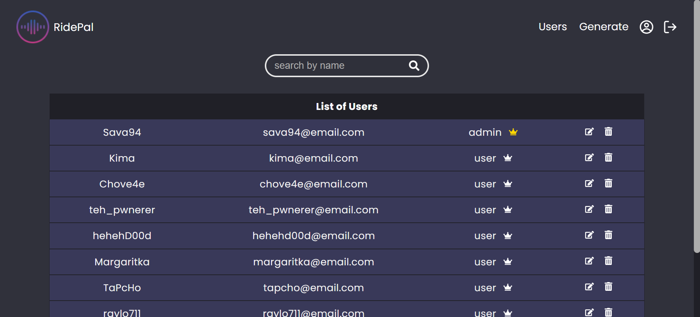
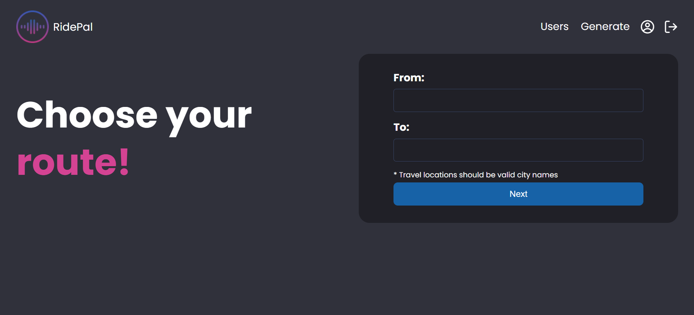
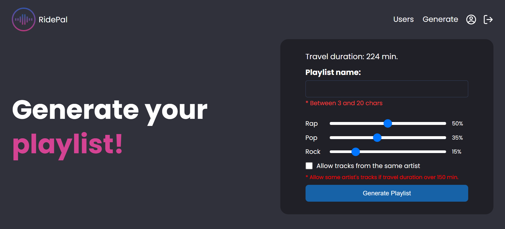
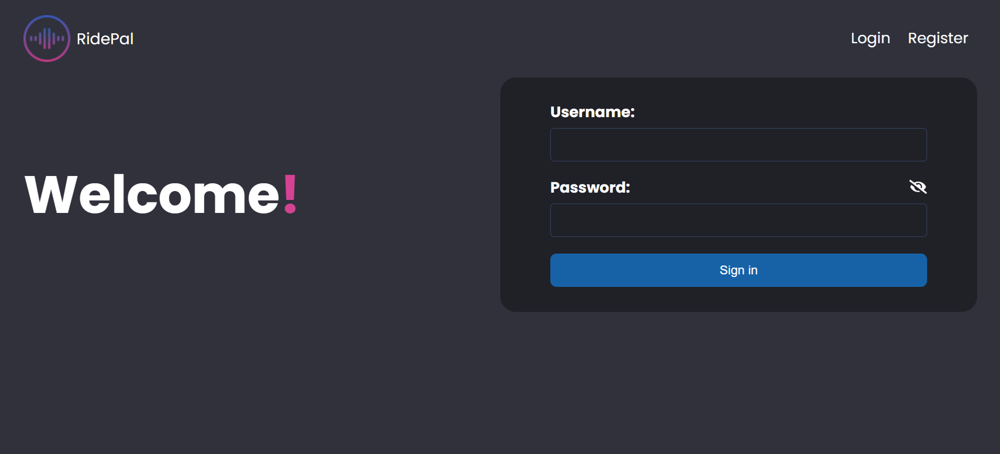

# RidePal Playlist Generator

### Description
RidePal Playlist Generator is a single-page application that enables users to generate playlists for specific travel duration periods, based on their preferred genres.

### Tech Stack
React.js, Express.js, Node.js, MariaDB, MySQL

### External Services
- Microsoft Bing Maps
- Deezer

### Setup
Backend:
1. Inside the `server` folder, run `npm install` to restore all dependencies.
2. You can setup a local database in two ways:
 - Import the database schema from the `empty-database` file in the `database` folder. After that use `npm run seed` in the `server` folder to fetch data from Deezer and add initial admin user.
 - Or directly import the database schema from the `full-database` file in the `database` folder which contains prefetched Deezer data as well as some mock data for users and playlists.
3. Inside the `server` folder, create a `.env` file with the following configuration:
```js
PORT=5555
HOST=localhost
DB_PORT=3306
USER= // insert MariaDB database username
PASSWORD= // insert MariaDB database password 
DATABASE=ridepal
PRIVATE_KEY=secretkey
```
4. Run `npm start`.
  
Frontend:
1. Inside the `client` folder, run `npm install` to restore all dependencies.
2. Run `npm start`.

### Pages
- Home page

- Tracklist

- Users

- Route choice

- Generate playlist

- Register

- Login
